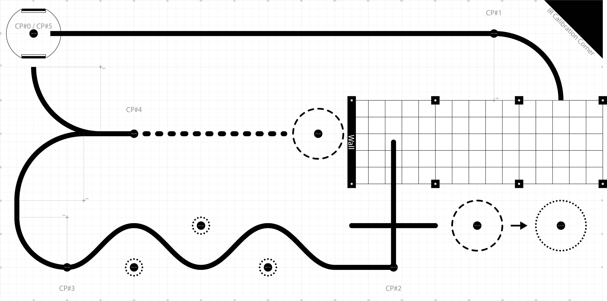

ME 405 Term Project
================================

Overview
--------
This project and the documentation on this website were created by Cal Poly students in ME 405 as their final deliverable for the term project. Students were tasked with programming a Pololu Romi robot to complete a printed course/track autonomously. The track has 5 checkpoints that the robot is required to reach and optional bonus challenges. Student groups implemented strategies of their choice to program their robot to reach each checkpoint.

Robot Components
-----------------
*The Pololu Romi chassis kit was configured with an STM32 Nucleo MCU and access via an ST Link shoe of Brian. All coding was done in python, downloaded via firmware on...*

Course Description
------------------
The course is defined by black marks printed on white grid paper. For most of the course, a thick line defines a path between checkpoints (CP 1-5). Infrared sensors can be used to detect the line, enabling the robot to navigate the couse via line following. Curves in the lines require fast feedback and tightly tuned control. The section of the course with no line is referred to as the "parking garage." In this section the robot must use an alternative means of navigation to maneuver under an aluminum structure. At the end of the parking garage is a wall. The robot must successfully correct its motion after hitting and/or detecting the wall. To complete the bounus challenges, the robot must move plastic cups into/out of the dashed circles on the course.

   Game track

Robot Design and Repository
---------------------------
Use the navigation sidebar to learn more about the design of our team's robot (affectionately called BB, or BumbleBee) and its performance on the course!

The GitHub repsoitory with all project files can be found here *add link*

*add photo of romi and maybe the course*

.. toctree::
   :maxdepth: 3
   :caption: Contents:

   self
   hardware
   program_structure
   performance