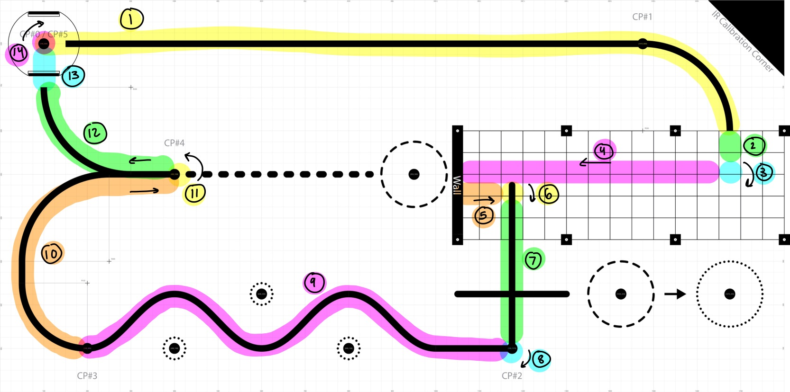

Program Structure
================================

Overview
--------
This project implements a modular control system for the robot using MicroPython on an STM32 Nucleo development board. The microcontroller uses customized firmware files provided by Dr. John Ridgely. The files are available on his ME 405 repository. The program is comprised of several hardware drivers and task files. The drivers are software classes that handle hardware configuruation, allowing for higher-level logic in the tasks. The tasks utilize functions created in the drivers to implement the logic that controls the robot's behavior. They control motor speed, read and respond to sensor data, run the state estimator, and respond to user input. All objects in the program are instantiated in a single file called main, which runs each time the robot is powered on. A scheduler file implements cooperative multitasking, running task objects based on their assigned priority and period. The scheduler driver and task can also be found in the documentation provided by Dr. Ridgely. All files from Dr. Ridgely can be found on his `GitHub Repository <https://github.com/spluttflob/ME405-Support>`_.

Course Strategy
--------------
Our team designed a specific task to run the logic for navigating the course. This task, called "course task," is implemented as a finite state machine. We split the course up into 14 segments, and each segment has its own state in the finite state machine. Each state waits for a specific condition to be met to trigger transition to the next state. To start a run, the user hits the blue user button on the Nuelceo. This moves course task from the intialization state into the first run state. Specific design choices and a description of the conditions that trigger transition are detailed in the sections below.

   Breakdown of the game track into states

Arc length
~~~~~~~~~~
Most state transitions occur when the arc length swept by either the left or right wheel reaches a predetermined threshold. The arc length is calculated by the motor tasks using methods from the encoder class. The encoders measure the rotation of the motor shaft, which can be used to comupute a corresponding linear distance (assuming no slip). This distance (in mm) is the arc length that is read by each state and used to trigger transitions. To avoid error accumulation over the duration of the run and keep each state modular, the monitored arc length value is reset upon each transition.

Heading
~~~~~~~
Some of the turn states rely on heading, rather than arc length, to determine when the turn is complete. The heading value is read from the imu in the imu task. The raw reading is calibrated upon startup so that the heading is zero at the start of the run. When robot needs to turn, the right and left motor speeds are set accordingly and the heading is monitored until it reaches a certain value, at which point the task changes states and stops the turn.

Collision
~~~~~~~~~
At the end of the parking garage, the robot hits a wall, and the collision is detected by the bump sensors on the front of the chassis. Hitting the bump sensors raises a flag, which triggers the state transition.

Line Following
~~~~~~~~~~~~~~
Most of the course is navigated by line following. Readings from the IR sensor array are used to calculate the normalized centroid of the reflectance intensity. The centroid gives a quantitatve representation of the position error relative to the center of the line. This error is fed into a PI controller that corrects the position by adjusting the setpoints for the left and right motor speeds.

The line follow task is be disabled in sections of the course that utilize other navigation strategies. When certain states are reached, a flag is raised to signal that linefollowing should be turned off. The line follow task checks this flag before each run and only runs if the flag is false. This happens a few times throughout the course, in the parking garage, for instance, and towards the end of the course when the robot returns to the starting position.

Heading Control
~~~~~~~~~~~~~~~
To navigate in the parking garage, the robot uses a heading controller to move straight without line following. Similar to the line following controller, the heading controller takes in a setpoint and regulates the left and right motor speeds to keep the heading at the setpoint value during forward motion. It is a PI controller uses the calibrated heading angle from the imu as feedback. 

Diagrams
--------
The task diagram below outlines the flow of information between tasks.

*task diagram*

The state-transition diagram below outlines the logic implemented by the course task to navigate the track.

*course task STD
maybe other STD*

Tasks and Drivers
----------
The drivers and tasks created for this program can be explored in depth using the navigation tree on the left or the links below. The methods and attributes that belong to each class are each described in breif in each tab.

.. toctree::
   :maxdepth: 1

   drivers
   tasks
   main <main_sphinx>